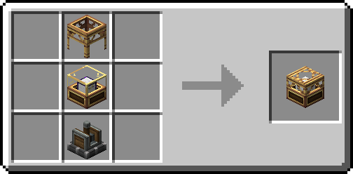
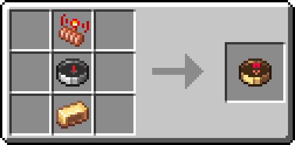
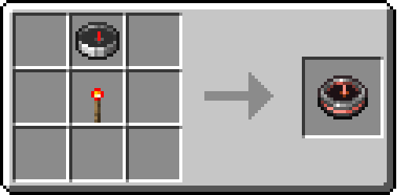

<h1 align="center">Aeronautic Additions Tweaks 
	<!--
    
      -->
</h1>

‼️This is an Add-on for an existing mod: [Aeronautic Additions and ChunkLoader](https://modrinth.com/mod/aeronautic-additions-and-chunkloader). It will not work without it installed.‼️

This projects revamps the textures as well as the recipes from the [Aeronautic Additions and ChunkLoader](https://modrinth.com/mod/aeronautic-additions-and-chunkloader) mod.
This repository contains a resource pack, a data pack and a mod containing both for easier access.

### The resource pack adds new textures for the "Player Compass" and the "Directional Compass":

 

It also adds a new model for the "Aeronautic Chunk Loader" focusing more on a Create oriented aesthetic:

### The data pack improves the recipes of the three items included in the mod:

Aeronautic Chunk Loader:

<small>Now requires the Brass Chunk Loader from [Create Power Loader](https://modrinth.com/mod/create-power-loader)</small>

Player Compass:

Directional Compass:

